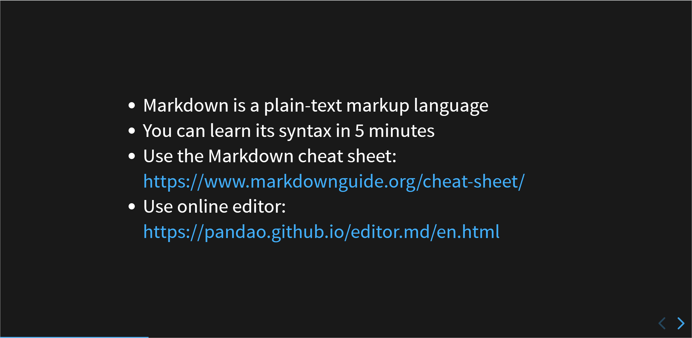

+++
outputs = ["Reveal"]
title = "Create online presentations with Hugo"

+++
## Create online presentations with Hugo and Markdown

---

* Online presentations are an alternative to PowerPoint
* They're free, open source, and use Markdown and Hugo under the hood

---

## What's Markdown?

---

* Markdown is a plain-text markup language
* You can learn its syntax in 5 minutes
* Use the Markdown cheat sheet: https://www.markdownguide.org/cheat-sheet/
* Use online editor: https://pandao.github.io/editor.md/en.html

---

## What's Hugo?

---

* Hugo is a static site generator
* It converts your Markdown files to the HTML pages
* Learn more about Hugo: https://gohugo.io/

---

## OK. But how do you build the online presentation?

---

## Prerequisites

---

* Git
* Hugo
* Visual Studio Code

---

## Run your site locally

---

* Fork this repo: https://github.com/ivancheban/online-presentation
* Go to the **online-presentation** folder.
* Run:
```
hugo server
```
* Go to the http://localhost:61669/ or other generated local host address.

---

## Edit the presentation

---

* Open the `online-presentation/content/_index.md` file and edit the slides.
* Use `---` before the next slide.
* Commit and push your changes to the remote repository.

---

## Deploy your site

---

* Sign up on Netlify: https://app.netlify.com/
* Add a new site by importing your forked repo from GitHub.

---

## Enjoy your online presentation!

---

